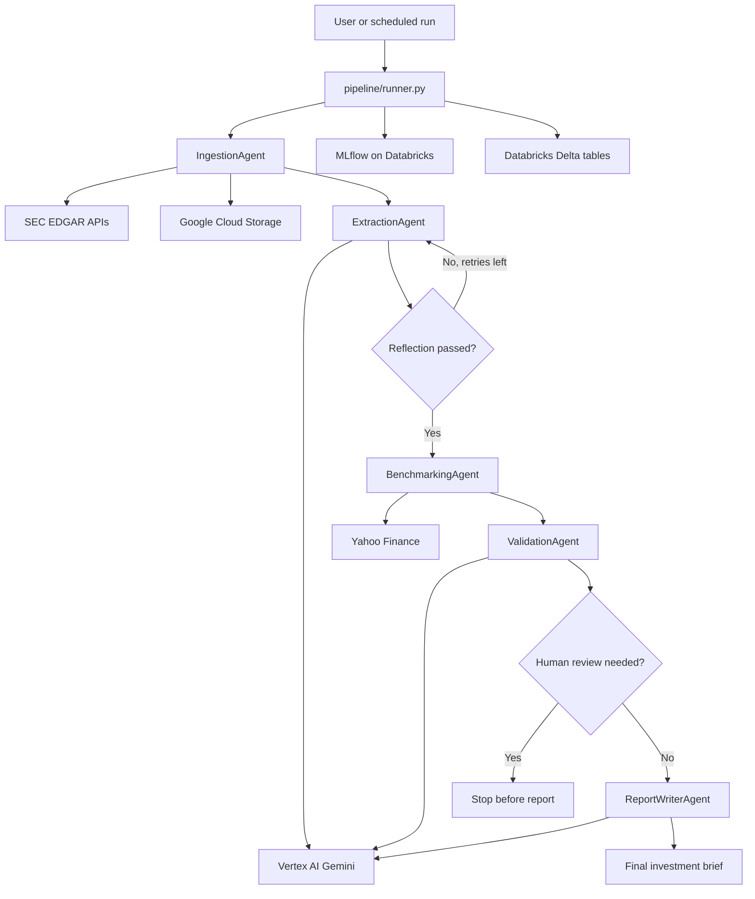

# AI Financial Analyst on GCP and Databricks

This document explains the complete codebase from the point of view of someone who has never seen the project before. It covers what the project does, how the files are organized, how the pipeline runs, what each agent is responsible for, which environment variables are required, how data moves through the system, and what is currently implemented versus still a placeholder.

## 1. Project Summary

This project is an agentic financial analysis pipeline. It takes a public company ticker and a reporting quarter, retrieves the company filing from the SEC, extracts financial KPIs with Google Vertex AI Gemini, compares the company against peer companies, validates the extracted numbers, creates a short investment brief, tracks the run in MLflow, and writes results into Databricks Delta tables.

The default company and quarter are:

```text
Ticker:  WMT
Quarter: 2024-Q3
```

The pipeline is designed around five major agents:

1. `IngestionAgent`: finds and downloads a SEC 10-Q filing, extracts text, and stores it in Google Cloud Storage.
2. `ExtractionAgent`: uses Gemini to extract financial KPIs from the filing text.
3. `BenchmarkingAgent`: discovers peer companies, fetches peer metrics from Yahoo Finance, and compares the company against peers.
4. `ValidationAgent`: validates the extracted KPI values and decides whether human review is needed.
5. `ReportWriterAgent`: uses Gemini to generate a concise investment brief.

## 2. What Problem This Project Solves

Financial analysts often read quarterly filings manually, identify important numbers, compare them with peers, validate whether the numbers look right, and write an investment summary. This codebase automates that workflow.

The project combines:

- SEC filing ingestion
- LLM-based KPI extraction
- Reflection and retry logic
- Dynamic peer discovery with Databricks cache
- Peer benchmarking
- KPI validation
- Human-in-the-loop decisioning
- Investment brief generation
- MLflow observability
- Databricks Delta table persistence
- Google Cloud Storage archival

## 3. High-Level Architecture



The pipeline is split across two files:

- `pipeline/graph.py` builds the LangGraph workflow with retry routing.
- `pipeline/runner.py` creates MLflow-tracked wrappers around the agents, injects those wrapped functions into the graph, and invokes the compiled graph.

The production entrypoint in the Dockerfile is `pipeline/runner.py`.

## 4. Repository Structure

```text
ai-financial-analyst-gcp-databricks/
.github/
  workflows/
    deploy.yml
agents/
  __init__.py
  benchmarking.py
  extraction.py
  ingestion.py
  peer_discovery.py
  report_writer.py
  state.py
  validation.py
app/
  streamlit_app.py
databricks_utils/
  __init__.py
  writer.py
  notebooks/
    01_create_tables.ipynb
    02_monitoring_setup.ipynb
    03_evaluation.ipynb
pipeline/
  __init__.py
  batch_runner.py
  graph.py
  runner.py
.env.local
databricks.yml
Dockerfile
requirements.txt
sa-key.json
test_peers.py
test.py
```

Important note: some files are currently placeholders or local helper files:

- `app/streamlit_app.py` is empty.
- `.github/workflows/deploy.yml` is empty.
- `databricks.yml` is empty.
- The three notebook files under `databricks_utils/notebooks/` are empty.
- `test.py` contains a direct Databricks workspace connection test and should not contain hard-coded tokens in a shared repository.
- `test_peers.py` is a helper script for testing peer discovery for `WMT`, `TGT`, and `COST`.
- `agents/peer_discovery.py` contains the dynamic peer discovery and Databricks cache logic used by benchmarking.
- `.env.local` and `sa-key.json` are local secret/configuration files and should not be committed to source control.

## 5. Main Runtime Flow

The main pipeline is started by running:

```bash
python pipeline/runner.py
```

When `pipeline/runner.py` runs, it performs these steps:

1. Loads environment variables from `.env` and `.env.local`.
2. Configures MLflow to use Databricks:

```python
mlflow.set_tracking_uri("databricks")
mlflow.set_experiment("/Shared/financial-analyst-pipeline")
```

3. Creates an initial pipeline state dictionary.
4. Starts a parent MLflow run for the ticker and quarter.
5. Builds the LangGraph pipeline with MLflow-tracked agent nodes.
6. Invokes the graph with `pipeline.invoke(initial_state)`.
7. Lets the graph handle routing, retry loops, HITL stopping, and report generation.
8. Logs agent-level and pipeline-level metrics to MLflow.
9. Writes the final state into Databricks Delta tables.
10. Prints a terminal summary.

By default, the runner reads:

```python
ticker = os.environ.get("TICKER", "WMT")
quarter = os.environ.get("QUARTER", "2024-Q3")
```

So if no environment variables are provided, it analyzes Walmart for quarter `2024-Q3`.

## 6. Pipeline State

All agents pass around a shared state object called `PipelineState`, defined in `agents/state.py`.

The state contains all inputs, intermediate outputs, validation results, final outputs, metadata, and error information.

### Input Fields

| Field | Meaning |
|---|---|
| `ticker` | Stock ticker symbol, for example `WMT`, `AMZN`, or `COST`. |
| `quarter` | Quarter string in `YYYY-QN` format, for example `2024-Q3`. |

### Ingestion Fields

| Field | Meaning |
|---|---|
| `gcs_pdf_path` | Google Cloud Storage path where the raw filing text was uploaded. Despite the name, the project currently uploads text, not necessarily a PDF. |
| `raw_text` | Extracted text from the SEC filing. |

### Extraction Fields

| Field | Meaning |
|---|---|
| `extracted_kpis` | Dictionary of financial KPIs extracted from the filing. |
| `tokens_used` | Approximate token/word count used during extraction. The code currently estimates this with `len(chunk.split())`. |
| `retry_count` | Number of retry/reflection cycles attempted. |
| `reflection_notes` | Notes from the LLM self-review step or validation retry feedback. |

### Benchmarking Fields

| Field | Meaning |
|---|---|
| `peer_benchmarks` | Peer comparison data from Yahoo Finance. |

### Validation Fields

| Field | Meaning |
|---|---|
| `confidence_score` | Numeric confidence score between 0 and 1. |
| `flagged_kpis` | KPI fields that failed validation or need caution. |
| `hitl_required` | Boolean indicating whether human-in-the-loop review is needed. |
| `validation_reasoning` | Text explanation of validation checks and concerns. |

### Report Fields

| Field | Meaning |
|---|---|
| `final_report` | Markdown investment brief generated by Gemini. |

### Metadata Fields

| Field | Meaning |
|---|---|
| `run_id` | Short UUID used to identify the pipeline run. |
| `pipeline_version` | Version label, currently `1.0.0`. |
| `error` | Error message if an agent failed. |

## 7. KPI Schema

The expected KPI shape is defined in `agents/state.py` as the `FinancialKPIs` Pydantic model:

| KPI | Type | Meaning |
|---|---|---|
| `revenue_usd_millions` | float | Company revenue in USD millions. |
| `net_income_usd_millions` | float | Net income in USD millions. |
| `eps_diluted` | float | Diluted earnings per share. |
| `gross_margin_pct` | float | Gross margin percentage. |
| `operating_cash_flow` | float | Operating cash flow in USD millions. |
| `revenue_yoy_growth_pct` | optional float | Year-over-year revenue growth percentage. |

The extraction prompt asks Gemini to return exactly these fields through the `return_extracted_kpis` tool call.

## 8. Agent Details

### 8.1 Ingestion Agent

File: `agents/ingestion.py`

Purpose:

The ingestion agent retrieves a company filing from SEC EDGAR, extracts readable text, uploads that text to Google Cloud Storage, and stores both the text and GCS path in the pipeline state.

Main functions:

| Function | Purpose |
|---|---|
| `get_cik(ticker)` | Converts a stock ticker into a SEC CIK number using `https://www.sec.gov/files/company_tickers.json`. |
| `get_filing_url(cik, quarter)` | Finds a 10-Q filing URL for the requested quarter from the SEC submissions API. |
| `download_pdf_text(filing_url)` | Downloads the filing and extracts text. Handles both PDF and HTML filings. |
| `upload_to_gcs(content, ticker, quarter)` | Uploads extracted text to GCS at `filings/{ticker}/{quarter}/filing.txt`. |
| `ingestion_agent(state)` | Orchestrates the ingestion step. |

SEC access:

The code uses this header:

```python
HEADERS = {"User-Agent": "yourname@youremail.com"}
```

SEC EDGAR expects a real user agent with contact information. Before using this seriously, replace this placeholder with a real name/email or organization contact.

Quarter matching:

The code maps quarters to approximate filing months:

```python
month_map = {"Q1": ["03"], "Q2": ["06"], "Q3": ["09"], "Q4": ["12"]}
```

Then it searches for a `10-Q` filing whose filing date is near the expected month. This is a practical approximation, not a full fiscal calendar engine. Companies with non-standard fiscal calendars may need custom handling.

Failure behavior:

If anything fails, the agent returns the same state with:

```python
"error": str(e)
```

Later agents skip work if `error` is present.

### 8.2 Extraction Agent

File: `agents/extraction.py`

Purpose:

The extraction agent sends chunks of filing text to Gemini and asks it to extract financial KPIs through Vertex AI function/tool calling. It also asks Gemini to review its own extracted values through a second tool call and retry if the model identifies problems.

Model:

```python
GenerativeModel("gemini-2.5-flash-lite")
```

Vertex AI is initialized with:

```python
vertexai.init(project=os.environ["GCP_PROJECT_ID"], location="us-central1")
```

Main functions:

| Function | Purpose |
|---|---|
| `chunk_text(text, max_chars=8000)` | Splits filing text into chunks of up to 8,000 characters. Only the first 40,000 characters are considered. |
| `tool_config(function_name)` | Forces Gemini to call the allowed function/tool for a structured response. |
| `get_function_args(response, function_name)` | Reads tool-call arguments from the Gemini response. |
| `extract_kpis_from_chunk(chunk, focus_hint="")` | Prompts Gemini to extract KPIs from one chunk using the `return_extracted_kpis` tool. |
| `merge_kpis(kpi_list)` | Combines KPI dictionaries, taking the first non-null value for each field. |
| `reflect_on_kpis(kpis, ticker)` | Asks Gemini to judge whether the extracted KPIs look reasonable using the `return_kpi_reflection` tool. |
| `run_extraction(raw_text, focus_hint="")` | Runs extraction across chunks and returns merged KPIs plus token estimate. |
| `extraction_agent(state)` | Orchestrates extraction, reflection, and retry signaling. |

Tool calls used:

| Tool name | Purpose |
|---|---|
| `return_extracted_kpis` | Returns structured KPI fields such as revenue, net income, EPS, gross margin, operating cash flow, and revenue growth. |
| `return_kpi_reflection` | Returns structured review fields: `looks_correct`, `concern`, and `fields_to_recheck`. |

Reflection logic:

After KPI extraction, Gemini receives a second prompt asking it to check for:

1. Required fields that are missing.
2. Implausible values.
3. Suspiciously round placeholder-like values.
4. EPS consistency with net income.
5. Gross margin reasonableness.

Gemini is forced to call the `return_kpi_reflection` tool with arguments shaped like:

```json
{
  "looks_correct": true,
  "concern": "none",
  "fields_to_recheck": []
}
```

If `looks_correct` is false, the agent increments `retry_count` and stores the concern in `reflection_notes`. The graph-based pipeline can use this to route back to extraction.

Current retry limit:

```python
MAX_RETRIES = 2
```

Important implementation detail:

The main runner now uses the graph retry behavior. `pipeline/runner.py` passes MLflow-wrapped versions of the agents into `build_pipeline(...)` and then calls `pipeline.invoke(initial_state)`. This means extraction reflection retries and validation-triggered retries are handled by the LangGraph routes in `pipeline/graph.py`.

### 8.3 Peer Discovery

File: `agents/peer_discovery.py`

Purpose:

The peer discovery module selects peer companies for benchmarking. It first checks a Databricks Delta cache. If valid cached peers exist, it reuses them. If the cache is missing or expired, it fetches candidate company data from Yahoo Finance, scores candidates by weighted similarity, selects the top peers, and writes the scored candidates back to Databricks.

Configuration:

| Constant | Meaning |
|---|---|
| `CACHE_TTL_DAYS` | Cache validity period, currently 90 days. |
| `TOP_N_PEERS` | Number of selected peers, currently 5. |
| `WEIGHTS` | Feature weights used to score peer similarity. |

Features used for peer similarity:

| Feature | Meaning |
|---|---|
| `log_market_cap` | Log-scaled market capitalization. |
| `ebitda_margin` | EBITDA margin. |
| `roic` | Currently sourced from Yahoo Finance return on assets. |
| `revenue_growth_1y` | Revenue growth. |
| `net_debt_to_ebitda` | Net debt divided by EBITDA. |
| `asset_turnover` | Asset turnover, or revenue divided by assets when available. |
| `ev_to_revenue` | Enterprise value to revenue. |
| `pe_ratio` | Trailing P/E ratio. |
| `price_to_book` | Price-to-book ratio. |
| `sub_industry_match` | Bonus for same industry or same sector. |

Main functions:

| Function | Purpose |
|---|---|
| `fetch_yf_peers(ticker)` | Returns a seeded candidate pool for known tickers. For unknown tickers, it logs the Yahoo Finance sector and returns an empty candidate pool. |
| `extract_features(ticker)` | Fetches company features from Yahoo Finance. |
| `normalise_features(target, candidates)` | Min-max normalizes numeric features across the target and candidate companies. |
| `sub_industry_score(...)` | Scores industry/sector similarity. |
| `compute_similarity(...)` | Computes weighted similarity for one candidate. |
| `read_cache(ticker)` | Reads selected peers from `main.financial.peer_discovery` if the cache is valid. |
| `write_cache(...)` | Writes scored peer candidates to `main.financial.peer_discovery`. |
| `discover_peers(ticker)` | Main entry point used by the benchmarking agent. |

Current candidate pools are seeded for known tickers:

```python
"WMT":  ["TGT", "COST", "KR", "AMZN", "BJ", "DG", "DLTR"]
"TGT":  ["WMT", "COST", "KR", "AMZN", "BJ", "DG", "DLTR"]
"COST": ["WMT", "TGT", "KR", "AMZN", "BJ", "DG", "DLTR"]
"AMZN": ["WMT", "TGT", "COST", "EBAY", "JD", "BABA", "SHOP"]
"KR":   ["WMT", "TGT", "COST", "ACI", "SFM", "CASY", "GO"]
```

The candidate pool is seeded, but ranking is dynamic because candidates are scored from live Yahoo Finance features and cached in Databricks.

### 8.4 Benchmarking Agent

File: `agents/benchmarking.py`

Purpose:

The benchmarking agent compares the extracted company KPIs with dynamically discovered peer companies. Peer selection comes from `agents.peer_discovery.discover_peers`, and peer metric values come from Yahoo Finance through the `yfinance` package.

Main functions:

| Function | Purpose |
|---|---|
| `get_peer_metrics(tickers)` | Fetches peer gross margin, trailing P/E, revenue growth, and EBITDA margin from Yahoo Finance. |
| `benchmarking_agent(state)` | Builds the benchmark object and stores it in `peer_benchmarks`. |

The output includes:

| Field | Meaning |
|---|---|
| `peers` | Selected peer tickers returned by dynamic peer discovery. |
| `peer_metrics` | Metrics for each peer ticker. |
| `sector_median_gross_margin` | Median peer gross margin. |
| `company_gross_margin` | Company gross margin from extracted KPIs. |
| `sector_rank` | Company rank among peers by gross margin. |
| `total_peers` | Number of peers plus the target company. |
| `margin_delta_vs_median` | Company gross margin minus sector median. |
| `discovery_method` | Currently set to `dynamic`. |

Limitation:

Peer discovery has dynamic scoring and Databricks caching, but the initial candidate pool is still seeded for known tickers. Unknown tickers currently return an empty candidate pool unless more sector mappings or a broader candidate source are added.

### 8.5 Validation Agent

File: `agents/validation.py`

Purpose:

The validation agent checks whether extracted KPIs are complete and reasonable. It also cross-checks EPS against Yahoo Finance and asks Gemini to reason about large EPS discrepancies.

Model:

```python
GenerativeModel("gemini-2.5-flash-lite")
```

Main functions:

| Function | Purpose |
|---|---|
| `get_reported_eps(ticker)` | Attempts to fetch reported quarterly EPS from Yahoo Finance. |
| `discrepancy_tool_config()` | Forces Gemini to call the allowed EPS discrepancy reasoning tool. |
| `get_function_args(response, function_name)` | Reads tool-call arguments from the Gemini response. |
| `llm_reason_about_discrepancy(...)` | Uses Gemini tool calling to explain whether an EPS mismatch is acceptable. |
| `validation_agent(state)` | Runs all validation checks and updates confidence, flags, and HITL status. |

Tool call used:

| Tool name | Purpose |
|---|---|
| `return_discrepancy_reasoning` | Returns `is_explainable`, `reasoning`, and `confidence_adjustment` for EPS discrepancies. |

Validation checks:

1. Completeness:
   Required KPI fields must be present:

```text
revenue_usd_millions
net_income_usd_millions
eps_diluted
gross_margin_pct
operating_cash_flow
```

2. EPS cross-check:
   If Yahoo Finance EPS and extracted EPS are both available, the code computes percentage difference.

   If the difference is greater than 5%, Gemini is asked to judge whether the discrepancy is explainable.

3. Gross margin bounds:
   Gross margin must be between 0 and 100.

4. Net margin sanity:
   Net margin is calculated from net income divided by revenue. Values below `-50%` or above `50%` are flagged as implausible.

Confidence scoring:

The agent builds a list of confidence factors and averages them:

```python
confidence_score = round(sum(confidence_factors) / len(confidence_factors), 3)
```

Human-in-the-loop condition:

```python
hitl_required = confidence_score < 0.75 or len(flagged) > 1
```

If human review is required, `pipeline/runner.py` skips report generation.

### 8.6 Report Writer Agent

File: `agents/report_writer.py`

Purpose:

The report writer uses Gemini to generate a concise investment brief from the extracted KPIs and peer benchmarks.

Main functions:

| Function | Purpose |
|---|---|
| `build_prompt(state)` | Creates the Gemini prompt for the investment brief. |
| `report_writer_agent(state)` | Sends the prompt to Gemini and stores the final Markdown report. |

Required report sections:

```text
## Executive Summary
## KPI Highlights
## Peer Comparison
## Key Risks
## Outlook
```

The report is limited by prompt instruction to 400 words maximum.

If a KPI was flagged by validation, the prompt tells Gemini to add:

```text
*(low confidence - verify against source)*
```

## 9. LangGraph Pipeline

File: `pipeline/graph.py`

This file defines a LangGraph state machine using `StateGraph(PipelineState)`.

Nodes:

| Node | Agent |
|---|---|
| `ingestion` | `ingestion_agent` |
| `extraction` | `extraction_agent` |
| `benchmarking` | `benchmarking_agent` |
| `validation` | `validation_agent` |
| `report_writer` | `report_writer_agent` |

Graph flow:

```text
ingestion -> extraction -> benchmarking -> validation -> report_writer -> END
```

Conditional routing:

- After extraction, `route_after_extraction` can route back to `extraction` if reflection detected a problem and retries remain.
- After validation, `route_after_validation` can route back to `extraction`, continue to `report_writer`, or end if human review is needed or an error occurred.

Retry limit:

```python
MAX_RETRIES = 2
```

Important note:

`build_pipeline()` accepts optional agent functions. This allows `pipeline/runner.py` to inject MLflow-tracked wrappers while keeping routing logic centralized in `pipeline/graph.py`. The compiled graph is now the main execution mechanism.

## 10. Runner and MLflow Tracking

File: `pipeline/runner.py`

This is the main operational script.

### `tracked`

This helper returns a wrapped version of an agent function. The wrapped function is registered as a LangGraph node and logs a nested MLflow run each time that node executes.

For every agent it logs:

- `latency_sec`
- `retry_count`
- `had_error`

Agent-specific logging:

| Agent | Metrics and artifacts |
|---|---|
| `ingestion_agent` | Common metrics only. |
| `extraction_agent` | `tokens_used`, `kpi_fields_found`, `reflection_notes.txt`, `extracted_kpis.json` |
| `benchmarking_agent` | Common metrics only. |
| `validation_agent` | `confidence_score`, `flagged_kpi_count`, `hitl_required`, `validation_reasoning.txt` |
| `report_writer_agent` | `report_length_chars`, `investment_brief.md` |

### `run_pipeline`

This function:

1. Creates a short UUID run ID.
2. Builds the initial state.
3. Starts a parent MLflow run.
4. Logs pipeline parameters:
   - `ticker`
   - `quarter`
   - `pipeline_version`
   - `model`
5. Builds the LangGraph pipeline with wrapped/tracked agent functions.
6. Calls `pipeline.invoke(initial_state)`.
7. Lets the graph decide whether to retry extraction, stop for HITL, or continue to report generation.
8. Logs summary metrics.
9. Writes results to Databricks.
10. Returns the final state dictionary.

Model logging:

The MLflow parent run logs the runtime model as:

```python
"model": "gemini-2.5-flash-lite"
```

This matches the Gemini model instantiated by the extraction, validation, and report writer agents.

## 11. Batch Runner

File: `pipeline/batch_runner.py`

Purpose:

Runs the pipeline across a small set of retail/commerce companies and quarters.

Tickers:

```python
["WMT", "TGT", "COST", "AMZN", "KR"]
```

Quarters:

```python
["2024-Q1", "2024-Q2", "2024-Q3", "2023-Q4"]
```

This creates 20 runs total.

The script sleeps for 3 seconds between runs:

```python
time.sleep(3)
```

This is done to avoid aggressively calling the SEC API.

At the end, it prints:

- status per ticker/quarter
- confidence score
- whether the run was automatic or required HITL
- success rate
- average confidence

Run it with:

```bash
python pipeline/batch_runner.py
```

## 12. Databricks Writer

File: `databricks_utils/writer.py`

Purpose:

Writes pipeline results into Databricks SQL tables.

Connection:

```python
sql.connect(
    server_hostname=os.environ["DATABRICKS_HOST"].replace("https://", ""),
    http_path=os.environ["DATABRICKS_HTTP_PATH"],
    access_token=os.environ["DATABRICKS_TOKEN"]
)
```

Required tables:

The code assumes the following tables already exist:

```text
main.financial.raw_filings
main.financial.extracted_kpis
main.financial.peer_discovery
main.financial.peer_benchmarks
main.financial.investment_briefs
```

### `raw_filings`

Inserted fields:

```text
ticker
quarter
filing_date
gcs_pdf_path
form_type
status
created_at
```

### `extracted_kpis`

Inserted fields:

```text
ticker
quarter
revenue_usd_millions
net_income_usd_millions
eps_diluted
gross_margin_pct
operating_cash_flow
revenue_yoy_growth_pct
confidence_score
flagged_kpis
hitl_required
human_validated
pipeline_version
created_at
```

### `peer_benchmarks`

Inserted fields:

```text
ticker
quarter
sector_median_margin
relative_rank
margin_delta_pct
benchmark_ts
peers_used
```

### `peer_discovery`

Used by `agents/peer_discovery.py` as a cache for dynamically scored peer candidates. The writer in `databricks_utils/writer.py` does not write this table directly; peer discovery reads and writes it through its own cache functions.

The cache stores fields such as:

```text
ticker
target_sub_industry
candidate_ticker
candidate_name
log_market_cap
ebitda_margin
roic
revenue_growth_1y
net_debt_to_ebitda
asset_turnover
ev_to_revenue
pe_ratio
price_to_book
sub_industry_score
similarity_score
is_selected_peer
cache_version
cache_reason
fetched_ts
is_manually_valid
updated_ts
```

### `investment_briefs`

Inserted fields:

```text
ticker
quarter
final_report
run_id
created_at
```

Important:

The repository contains notebook filenames for table creation, monitoring, and evaluation, but those notebooks are currently empty. The table creation SQL is therefore not present in this codebase yet.

## 13. Local Configuration

The project uses environment variables loaded from `.env` and `.env.local`.

The local `.env.local` file in this workspace contains these variable names:

```text
GOOGLE_APPLICATION_CREDENTIALS
GCP_PROJECT_ID
GCS_BUCKET
DATABRICKS_HOST
DATABRICKS_TOKEN
DATABRICKS_HTTP_PATH
FMP_API_KEY
```

### Required Variables

| Variable | Required by | Purpose |
|---|---|---|
| `GOOGLE_APPLICATION_CREDENTIALS` | Google SDKs | Path to the GCP service account key file. |
| `GCP_PROJECT_ID` | Vertex AI | Google Cloud project ID used by Vertex AI. |
| `GCS_BUCKET` | Ingestion agent | Bucket where filing text is uploaded. |
| `DATABRICKS_HOST` | Databricks writer, MLflow | Databricks workspace URL. |
| `DATABRICKS_TOKEN` | Databricks writer | Personal access token or service principal token. |
| `DATABRICKS_HTTP_PATH` | Databricks writer | SQL warehouse HTTP path. |
| `TICKER` | Runner | Optional override for ticker. Defaults to `WMT`. |
| `QUARTER` | Runner | Optional override for quarter. Defaults to `2024-Q3`. |
| `FMP_API_KEY` | Currently unused | Present in `.env.local`, but no current code references it. |

Example `.env.local` shape:

```bash
GOOGLE_APPLICATION_CREDENTIALS=./sa-key.json
GCP_PROJECT_ID=your-gcp-project-id
GCS_BUCKET=your-gcs-bucket
DATABRICKS_HOST=https://your-workspace.cloud.databricks.com
DATABRICKS_TOKEN=your-token
DATABRICKS_HTTP_PATH=/sql/1.0/warehouses/your-warehouse-id
TICKER=WMT
QUARTER=2024-Q3
```

Do not commit real values for secrets.

## 14. Dependencies

File: `requirements.txt`

Dependency groups:

### Agent Pipeline

```text
langgraph
langchain-google-vertexai
langchain-core
```

These support graph-based agent workflows and LangChain integrations.

### LLM Structured Output

```text
instructor
pydantic
```

`pydantic` is used directly for the KPI schema. `instructor` is installed but not currently used in the code.

### PDF and Data

```text
pdfplumber
yfinance
pandas
requests
```

These handle SEC downloads, HTML/PDF text extraction, and market/peer data.

### Databricks

```text
databricks-sdk
databricks-sql-connector
```

These support Databricks workspace/table access and SQL inserts.

### GCP

```text
google-cloud-storage
google-cloud-secret-manager
```

Storage is used directly. Secret Manager is installed but not currently used.

### Observability

```text
langfuse
mlflow
```

MLflow is used directly. Langfuse is installed but not currently used.

### Serving

```text
streamlit
```

Streamlit is installed, but `app/streamlit_app.py` is currently empty.

### Development

```text
python-dotenv
```

Used to load `.env` and `.env.local`.

## 15. Dockerfile

File: `Dockerfile`

The Dockerfile builds a Python 3.11 image:

```dockerfile
FROM python:3.11-slim

WORKDIR /app
COPY requirements.txt .
RUN pip install --no-cache-dir -r requirements.txt

COPY . .

ENV PORT=8080
EXPOSE 8080

CMD ["python", "pipeline/runner.py"]
```

Important:

Although the comment says Cloud Run expects a `PORT` environment variable, the container command runs a batch-style Python script, not an HTTP web server. Cloud Run services usually need to listen on the given port. As written, this Docker image is better suited for a job-style execution unless a web server is added.

## 16. Streamlit App

File: `app/streamlit_app.py`

This file is currently empty.

The dependency `streamlit==1.38.0` is installed, so the project appears prepared for a UI, but no Streamlit interface has been implemented yet.

A future Streamlit app could provide:

- ticker and quarter inputs
- a button to run the pipeline
- real-time agent status
- KPI table display
- confidence score display
- final report preview
- HITL review controls

## 17. Databricks Notebooks

Folder: `databricks_utils/notebooks/`

The repository currently contains these notebook files:

```text
01_create_tables.ipynb
02_monitoring_setup.ipynb
03_evaluation.ipynb
```

All three files are currently empty in this workspace.

Based on their names, they are intended for:

| Notebook | Intended purpose |
|---|---|
| `01_create_tables.ipynb` | Create the required Databricks tables under `main.financial`. |
| `02_monitoring_setup.ipynb` | Set up monitoring dashboards or quality checks. |
| `03_evaluation.ipynb` | Evaluate extraction/report quality over historical runs. |

Because they are empty, table schemas and monitoring logic must currently be created outside the repository or added later.

## 18. GitHub Workflow and Databricks Bundle

### `.github/workflows/deploy.yml`

This file exists but is empty.

No GitHub Actions CI/CD pipeline is currently implemented.

### `databricks.yml`

This file exists but is empty.

No Databricks Asset Bundle configuration is currently implemented.

## 19. `test.py`

File: `test.py`

This file creates a `WorkspaceClient`, lists tables under `main.financial`, and prints table names.

Purpose:

It appears to be a quick manual check that Databricks credentials can access the expected schema.

Security concern:

The file currently contains a hard-coded Databricks host and token. Tokens should be moved into `.env.local` or a secret manager and removed from source files.

Safer pattern:

```python
import os
from databricks.sdk import WorkspaceClient

w = WorkspaceClient(
    host=os.environ["DATABRICKS_HOST"],
    token=os.environ["DATABRICKS_TOKEN"],
)
```

## 20. How to Set Up Locally

### Step 1: Create and activate a virtual environment

PowerShell:

```powershell
python -m venv .venv
.\.venv\Scripts\Activate.ps1
```

### Step 2: Install dependencies

```powershell
pip install -r requirements.txt
```

### Step 3: Create `.env.local`

Create a `.env.local` file with the required environment variables listed in section 13.

### Step 4: Authenticate with Google Cloud

The project expects Google credentials through:

```text
GOOGLE_APPLICATION_CREDENTIALS
```

That variable should point to a service account key file with access to:

- Vertex AI
- Google Cloud Storage bucket used by `GCS_BUCKET`

### Step 5: Prepare Databricks

Before running the full pipeline, make sure:

- Databricks SQL warehouse is available.
- `DATABRICKS_HOST` is set.
- `DATABRICKS_HTTP_PATH` is set.
- `DATABRICKS_TOKEN` is set.
- The `main.financial` schema exists.
- Required tables exist:
  - `raw_filings`
  - `extracted_kpis`
  - `peer_discovery`
  - `peer_benchmarks`
  - `investment_briefs`

### Step 6: Run one pipeline

```powershell
python pipeline\runner.py
```

Optional overrides:

```powershell
$env:TICKER="COST"
$env:QUARTER="2024-Q2"
python pipeline\runner.py
```

### Step 7: Run batch mode

```powershell
python pipeline\batch_runner.py
```

## 21. External Services Used

### SEC EDGAR

Used by `agents/ingestion.py`.

Endpoints:

```text
https://www.sec.gov/files/company_tickers.json
https://data.sec.gov/submissions/CIK{cik}.json
https://www.sec.gov/Archives/edgar/data/...
```

Purpose:

- Map ticker to CIK.
- Find recent filings.
- Download the primary 10-Q filing document.

### Google Vertex AI

Used by:

- `agents/extraction.py`
- `agents/validation.py`
- `agents/report_writer.py`

Purpose:

- Extract KPIs.
- Reflect on extraction quality.
- Reason about EPS discrepancies.
- Generate investment briefs.

### Google Cloud Storage

Used by `agents/ingestion.py`.

Purpose:

- Store raw filing text at:

```text
gs://{GCS_BUCKET}/filings/{ticker}/{quarter}/filing.txt
```

### Yahoo Finance

Used by:

- `agents/benchmarking.py`
- `agents/peer_discovery.py`
- `agents/validation.py`

Purpose:

- Discover and score peer candidates.
- Fetch peer gross margins, P/E ratios, revenue growth, and EBITDA margins.
- Fetch reported EPS for validation.

### Databricks

Used by:

- `pipeline/runner.py`
- `databricks_utils/writer.py`
- `test.py`

Purpose:

- MLflow experiment tracking.
- SQL table persistence.
- Expected Delta Lake storage.

## 22. Error Handling

The main error pattern is:

```python
return {**state, "error": str(e)}
```

Agents check:

```python
if state.get("error"):
    return state
```

This means one failed agent stops meaningful downstream processing while preserving the state for logging and writing failure status.

Known behavior:

- If ingestion fails, later agents skip work.
- `write_to_databricks` still writes a row to `raw_filings` with status `error`.
- If `error` is set, Databricks writer returns before writing KPI, benchmark, or report tables.

## 23. Human-in-the-Loop Logic

The validation agent sets:

```python
hitl_required = confidence_score < 0.75 or len(flagged) > 1
```

If `hitl_required` is true:

- `pipeline/runner.py` skips the report writer.
- The final state is still logged and written.
- The run is marked as needing human review.

There is currently no UI or workflow for completing human review. The `human_validated` value written to Databricks is always `False`.

## 24. Observability

MLflow is the primary observability tool.

Experiment:

```text
/Shared/financial-analyst-pipeline
```

Tracking URI:

```text
databricks
```

MLflow captures:

- per-agent latency
- errors
- extracted KPI JSON
- final report artifact
- validation reasoning
- reflection notes
- confidence score
- retry count
- HITL status
- total pipeline latency

This makes it possible to inspect each pipeline run and diagnose which stage failed or produced low confidence.

## 25. Current Limitations

1. The notebooks are empty.
   - Table creation, monitoring, and evaluation notebooks are placeholders.

2. The Streamlit app is empty.
   - There is no user interface yet.

3. SEC quarter matching is approximate.
   - It may not work reliably for companies with non-calendar fiscal years.

4. Peer discovery still depends on seeded candidate pools.
   - Candidate scoring is dynamic and cached in Databricks, but unknown tickers currently return no candidates unless more mappings or a broader source are added.

5. `test.py` contains a hard-coded Databricks token.
   - This should be removed and replaced with environment variables.

6. The Dockerfile is not a complete Cloud Run web service.
   - It starts a Python script but does not serve HTTP traffic.

7. Some installed dependencies are unused.
   - `instructor`, `google-cloud-secret-manager`, `langfuse`, and `streamlit` are installed but not currently used in implemented code.

8. `app/streamlit_app.py`, `databricks.yml`, and `deploy.yml` are placeholders.

9. The code contains some mojibake characters in comments and printed messages.
    - These look like encoding artifacts from em dashes and box-drawing characters.
    - They do not usually affect runtime, but they reduce readability.

## 26. Security Notes

Do not commit these files with real secret values:

```text
.env.local
sa-key.json
test.py with hard-coded tokens
```

Recommended improvements:

- Add `.env.local` to `.gitignore`.
- Add `sa-key.json` to `.gitignore`.
- Remove hard-coded token values from `test.py`.
- Use Databricks secrets, Google Secret Manager, GitHub Actions secrets, or environment variables.
- Rotate any token that has already been committed or shared.
- Replace SEC `User-Agent` placeholder with real contact information.

## 27. Suggested `.gitignore`

The repository does not currently show a `.gitignore` file in the inspected workspace. A safe starting point would be:

```gitignore
.venv/
__pycache__/
*.pyc
.env
.env.local
sa-key.json
*.log
.DS_Store
```

## 28. Typical Developer Workflow

For a developer working on the project:

1. Pull the latest code.
2. Create or activate the virtual environment.
3. Install dependencies.
4. Configure `.env.local`.
5. Confirm GCP credentials work.
6. Confirm Databricks SQL warehouse and tables exist.
7. Run one ticker/quarter with `pipeline/runner.py`.
8. Inspect MLflow in Databricks.
9. Inspect written rows in Databricks SQL.
10. Run `pipeline/batch_runner.py` when testing monitoring or evaluation.

## 29. Example End-to-End Run

Command:

```powershell
$env:TICKER="WMT"
$env:QUARTER="2024-Q3"
python pipeline\runner.py
```

Expected high-level behavior:

1. The runner starts an MLflow parent run named `WMT_2024-Q3`.
2. Ingestion finds Walmart's CIK and a matching 10-Q filing.
3. Filing text is uploaded to GCS.
4. Gemini extracts KPIs.
5. Gemini reflects on whether the KPIs look valid.
6. Peer candidates are discovered, scored, cached in Databricks, and then used for benchmarking.
7. Validation checks missing fields, EPS discrepancy, gross margin bounds, and net margin sanity.
8. If confidence is high enough, Gemini writes an investment brief.
9. Results are inserted into Databricks SQL tables.
10. Summary metrics and artifacts are visible in MLflow.

## 30. Glossary

| Term | Meaning |
|---|---|
| Agent | A function that performs one step in the pipeline and returns updated state. |
| CIK | Central Index Key, the SEC identifier for a company. |
| EDGAR | SEC's public filing system. |
| 10-Q | Quarterly report filed by public companies in the United States. |
| KPI | Key performance indicator, such as revenue or EPS. |
| GCS | Google Cloud Storage. |
| HITL | Human in the loop, meaning a person should review the output. |
| MLflow | Experiment tracking system used here through Databricks. |
| Delta table | Databricks table format used for reliable analytics storage. |
| Vertex AI | Google Cloud platform for AI model execution. |
| Gemini | Google's generative AI model family. |

## 31. File-by-File Reference

| File | What it does |
|---|---|
| `agents/state.py` | Defines KPI schema and shared pipeline state. |
| `agents/ingestion.py` | Downloads SEC filings, extracts text, uploads text to GCS. |
| `agents/extraction.py` | Uses Gemini to extract KPIs and reflect on extraction quality. |
| `agents/peer_discovery.py` | Discovers, scores, and caches peer companies for benchmarking. |
| `agents/benchmarking.py` | Uses discovered peers and Yahoo Finance metrics to compare against peer companies. |
| `agents/validation.py` | Scores confidence, flags risky KPI values, and decides HITL. |
| `agents/report_writer.py` | Uses Gemini to generate final investment brief. |
| `pipeline/graph.py` | Defines LangGraph workflow and conditional retry routes. |
| `pipeline/runner.py` | Main runner with MLflow tracking and Databricks write-back. |
| `pipeline/batch_runner.py` | Runs the pipeline for multiple tickers and quarters. |
| `databricks_utils/writer.py` | Inserts pipeline output into Databricks SQL tables. |
| `app/streamlit_app.py` | Placeholder for a future Streamlit UI. |
| `requirements.txt` | Python dependencies. |
| `Dockerfile` | Container build definition. |
| `databricks.yml` | Empty placeholder for Databricks Asset Bundle config. |
| `.github/workflows/deploy.yml` | Empty placeholder for CI/CD. |
| `test_peers.py` | Helper script for testing peer discovery on `WMT`, `TGT`, and `COST`. |
| `test.py` | Manual Databricks table listing test; currently contains hard-coded credentials and should be cleaned. |

## 32. Best Next Improvements

The most useful next engineering improvements would be:

1. Remove hard-coded secrets from `test.py`.
2. Add `.gitignore`.
3. Fill `01_create_tables.ipynb` or add SQL migration files for the required Databricks tables.
4. Add tests for the LangGraph routing paths, especially extraction reflection retries and validation-triggered retries.
5. Build the Streamlit UI if an interactive user workflow is needed.
6. Expand peer candidate sourcing beyond the current seeded Yahoo Finance candidate pools.
7. Add unit tests for tool-call parsing, peer discovery scoring, routing, validation scoring, and Databricks write payloads.
8. Update the Docker image to run as a Cloud Run Job or add an HTTP server if deploying as a Cloud Run Service.
9. Replace placeholder SEC user agent with a real contact.
